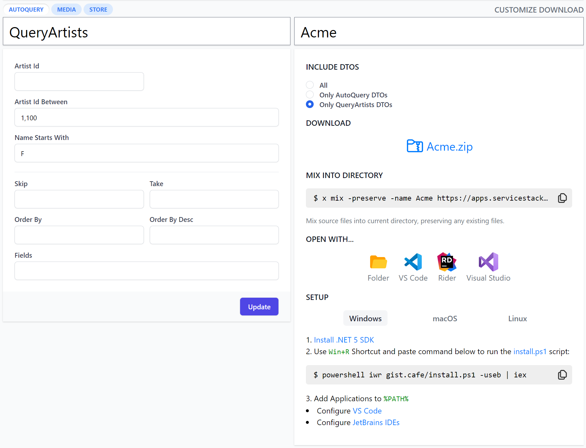
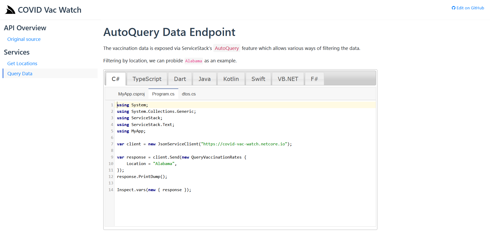
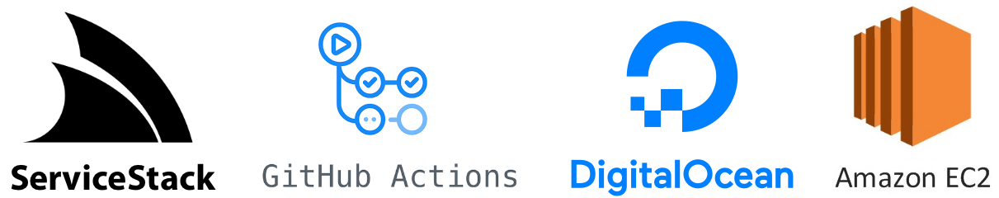
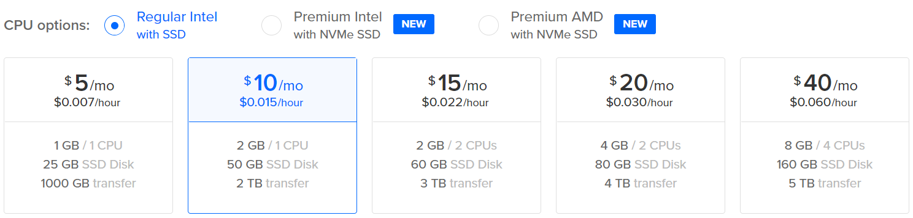
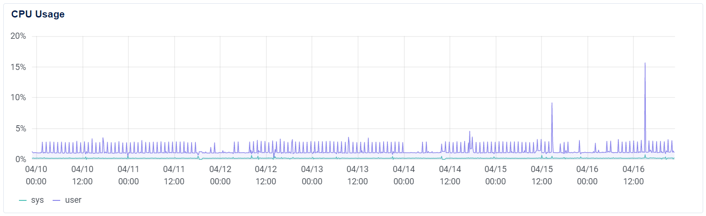
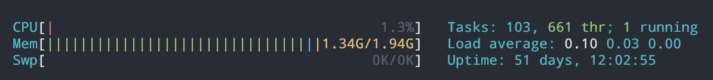
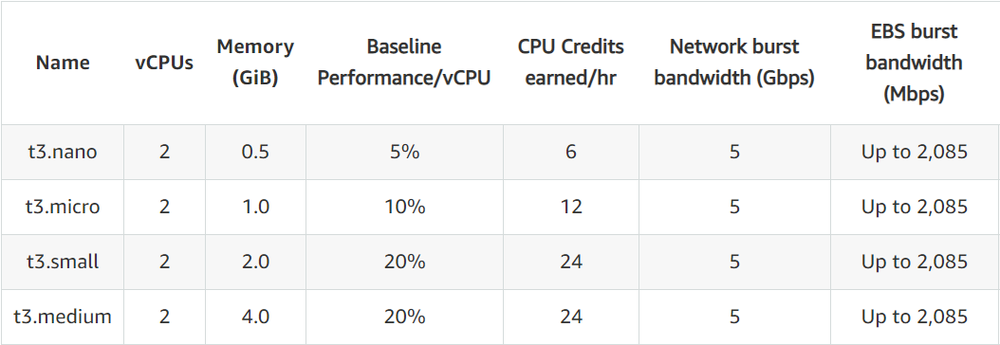
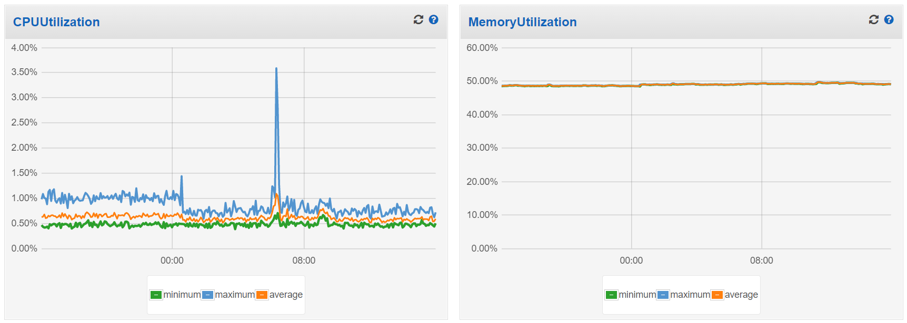
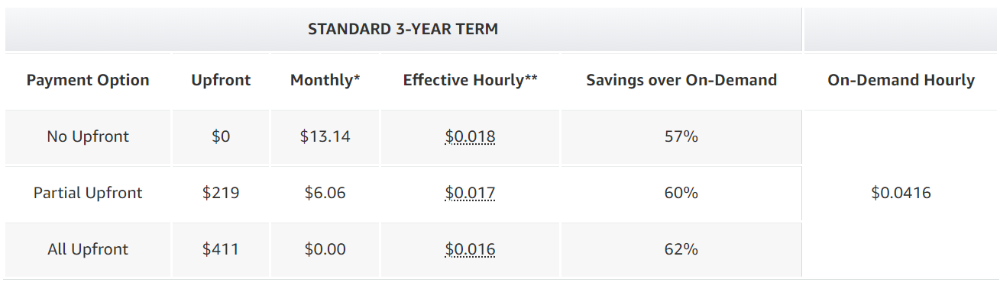

A nice aspect of the flagship features in this release is that they build upon ServiceStack's existing unique 
capabilities to enable even higher value-added features:

 - [Instant Client Apps](#instant-client-apps)
 - [GitHub Actions Templates](#github-actions-templates)

To capture the unprecedented productivity unlocked by this release we've created a video showing how much
is possible in a few minutes with ServiceStack, starting from just an existing RDBMS: 

<iframe width="896" height="525" src="https://www.youtube.com/embed/NaJ7TW-Q_pU" frameborder="0" allow="autoplay; encrypted-media" allowfullscreen></iframe>

This video walks through creating a new GitHub project with an [empty web project](https://github.com/NetCoreApps/Chinook#chinook) from scratch, then:

 - Uses AutoGen to create high-performance AutoQuery & CRUD APIs over the entire Chinook RDBMS
 - Query RDBMS Tables using implicit AutoQuery conventions
 - Convert AutoGen Services into code-first Services
 - Use the synthesized code-base to create a new Artist, Album & Track from a remote typed client
 - Extend AutoQuery Services with typed API Filters
 - Mix in GitHub Actions Template for deploying docker-compose containers to a new Digital Ocean $5/month Droplet
 - Create a GitHub release to automate deployment to our new Droplet
 - Open deployed App in ServiceStack Studio and use its Instant UI to query & create Artists & Albums
 - Open deployed App in Instant Client Apps to craft a C# API from an Auto UI

This guide is [documented every step of the way](https://github.com/NetCoreApps/Chinook), follow along 
to unlock these timeless productivity features for yourself!

### Use AutoGen to instantly generate AutoQuery APIs for your RDBMS

We encourage you to try out the magical [AutoGen](https://docs.servicestack.net/autogen) feature on your own 
internal RDBMS for the fastest way to enter the productive the world of AutoQuery which lets you instantly generate 
high-performance [AutoQuery](/autoquery-rdbms) & [CRUD](/autoquery-crud) APIs around your RDBMS Tables, view them 
in [ServiceStack Studio's](/studio) Auto UI and make use of [Instant Client Apps](#instant-client-apps) to bootstrap 
a new Web, Mobile or Desktop Client App.

### Value of APIs

A primary goal for ServiceStack is to capture your systems functionality in a typed Service contract that yields
the most reusable & evolvable API design. It's why ServiceStack encourages a contract-first,
message-based & coarse-grained typed API Design, which not only benefits the evolution of your Service APIs behind
its most reusable form, but also benefits ServiceStack who's able to maximize the utility of your Services
and make it available in multiple endpoints (e.g. HTTP,MQ,gRPC,SOAP,Service & RPC Gateway), call styles & 
serialization formats, more than any other Services framework.

The other side of the API boundary is the other important area where APIs can add the most value by making it
as simple as possible for API Consumers to call your APIs thereby making your APIs more appealing and creating 
multiplicative value with the time & effort saved by each API consumer.

### Optimal end-to-end development UX

Providing the best end-to-end API development UX is where ServiceStack has excelled for over a decade where
it's still one of the only solutions allowing for an optimal end-to-end API without code-gen, which it enables
for multiple [generic .NET Service Clients](/csharp-client#built-in-clients) in multiple 
[text & binary formats](/csharp-client#httpwebrequest-service-clients) all implementing the same 
substitutable interfaces. This ability is a consequence of design in capturing your entire API boundary into
perfectly symmetrical impl-free Service Contracts where the same DTOs Services implement on the Server are also 
what clients use to invoke APIs.

The benefit afforded from this design extends to each of the popular Web, Mobile & Desktop
[Add ServiceStack Reference](https://docs.servicestack.net/add-servicestack-reference) languages ServiceStack
natively supports, as they only need be concerned with generating impl-free, declarative DTO Service Contracts 
in each language. This results in much richer DTOs whose code generation also captures exported interfaces
& declarative route information, API metadata & Validation attributes in languages that support it as well
as exporting more optimal & specific types as it's able to translate types directly from .NET's richer type system 
instead of the more restrictive primitive data types set found in other generic code-gen solutions.

The benefits for only needing to generate DTOs is multifold, there's less boilerplate code to generate, the models
are richer, cleaner and more reusable as POCO data models within client applications. They also can used within
smart generic Service Clients that maintains higher-level functionality beyond a generic HTTP Client with built-in 
support for Authentication, Auto Retries, Auto Batched Requests, Stateful Cookie Sessions, etc. wrapped behind
a consistent and idiomatic generic client interface.

## Instant Client Apps

Building upon our native end-to-end typed solutions, we're excited to announce **Instant Client Apps** to 
provide instant utility and value around your ServiceStack Services where your API consumers can use the 
Auto generated UI to craft API Requests in their preferred programming language:


### Customize Download

A benefit to owning the entire code-generation technology stack is being able to control the complete end-user 
development experience and provide richer more customizable features like choosing to download **all API DTOs**,
only DTOs defined within a [tag group](/api-design#group-services-by-tag) for Systems that group their APIs into 
targeted collections (e.g. `[web]`,`[mobile]`,`[desktop]`) whilst users who are only interested in only calling 1 API 
can download just that **single Request DTO** (inc. all its dependencies) for a much smaller & more tailored download.    



### Download .zip

Instant Client Apps also caters for users that prefer not to install any software who can download a .zip of their
Client App pre-configured with their ProjectName that they can unzip and run in their preferred dev environment
that way.

### Open Instantly in preferred IDE

At its most productive, API Users who've installed our cross-platform utility will be able to instantly open their
crafted API directly in their preferred IDE. The previously time & effort intensive task for users to setup a new 
development environment to be able to explore your API in their preferred language and IDE is now reduced to seconds.

### Mix into an existing code-base

Another popular use-case that's catered for is being able to non-destructively [mix](/mix-tool) the client App 
source files directly into existing code bases, preserving any existing files.

This is also useful for Client Applications that need to start from an existing scaffolded project template like
incorporating their client Dart App into a new Flutter Mobile App as seen in this video:

<iframe width="896" height="525" src="https://www.youtube.com/embed/5crcDfl467Q" frameborder="0" allow="autoplay; encrypted-media" allowfullscreen></iframe>

### Share Executable API Examples

A nice feature of Instant Client Apps is that each custom API Example compiles down into a single URL which can be 
easily shared, linked to and embedded in Docs & Emails. E.g. You can view the Typed Chinook AutoQuery API Example 
used in the video and docs from the link below:

 - [apps.servicestack.net/#chinook.netcore.io/csharp/AutoQuery/QueryArtists(ArtistIdBetween:[1,100],NameStartsWith:F)](https://apps.servicestack.net/#chinook.netcore.io/csharp/AutoQuery/QueryArtists(ArtistIdBetween:[1,100],NameStartsWith:F))

Which captures the remote ServiceStack **BaseUrl**, the **C#** Language to view the example in, the selected 
**AutoQuery** Tag Group, the **QueryArtists** Request DTO being queried and all its **populated properties**.  

### Embed API Examples to create Interactive API Docs

A richer experience you can offer your API Consumers beyond sharing links to API Examples is being able to 
generate interactive API docs around your APIs. 

To further this goal [apps.servicestack.net](https://apps.servicestack.net) also lets you capture API Examples into
embeddable iframes that you can embed into your API Docs, e.g:

[](https://servicestackapps.github.io/CovidVaccinationWatch/doc-generation)

For a quick preview of this we've created an API Docs example site around the Covid Vaccines APIs used in
the [Instant Client Apps Flutter Demo](https://www.youtube.com/watch?v=5crcDfl467Q) above:

##### [servicestackapps.github.io/CovidVaccinationWatch/](https://servicestackapps.github.io/CovidVaccinationWatch/)

 - [QueryData](https://servicestackapps.github.io/CovidVaccinationWatch/autoquery)
 - [Get Locations](https://servicestackapps.github.io/CovidVaccinationWatch/get-locations)

[](https://servicestackapps.github.io/CovidVaccinationWatch/autoquery)

Here we show an example of skinning the embeddable API Docs inside of our own jQuery UI Tab plugins widget that
is then embedded inside the API docs pages.

Being able to quickly and effortlessly generate beautiful API docs is an area we want to explore more in future.
We don't believe trying to mechanically automate API docs generation is going to result in the best API docs for your 
end users, instead we envisage it should end up being a mix of static documentation around interactive code examples 
where you have full flexibility in how its presented to the end user. But it should be something we can provide
tools to help scaffold a static site around interactive code examples that they'll be able to open with a single 
click directly in their IDE.

### Synthesize API Code Examples

A side-effect of Instant Client Apps being stateless is that they require your API to always be accessible as
it uses its API metadata and Server Generated DTOs in order to generate the Client App Source files. It does maintain
a short cache of both in order to provide a responsive UX, but otherwise your API needs to be live which is 
potentially an undesirable trait for API docs that you want users to still be able to read whilst your API
is down or undergoing maintenance.

However this is easy enough to workaround by synthesizing the dynamic source files and publishing them to an immutable 
gist. To do this you can either download & extract **MyApp.zip** or copy the **MIX INTO DIRECTORY** script to write all 
the files into a new folder which you can then publish to a gist with the `x publish` command:

```
$ x publish -desc "Chinook Query Artists Example"
```

This will create a gist under your GitHub account and print both the link to your GitHub Gist and viewing it
in [gist.cafe](https://gist.cafe):

```
published to: https://gist.github.com/gistlyn/d3a0dfcd0851d928badad66b90affc06

view in: https://gist.cafe/d3a0dfcd0851d928badad66b90affc06
```

Going to [gist.cafe](https://gist.cafe) will let you further customize the embeddable code example and provide
multiple embed options, e.g. you can simply replace the gist id in the `<script/>` tag below:

```html
<script src="https://gist.cafe/embed/d3a0dfcd0851d928badad66b90affc06.js"></script>
```

> To publish gists you'll need to generate a 
[GitHub Access Token](https://github.com/settings/tokens/new?scopes=gist&description=gist.cafe) with **gist** scope 
and add it to your `GITHUB_TOKEN` Environment Variable.

## JWT Refresh Token Cookies

JWT now includes first-class support for Refresh Token Cookies which is implicitly enabled when configuring the 
`JwtAuthProvider` to use Cookies:

```csharp
Plugins.Add(new AuthFeature(() => new AuthUserSession(),
    new IAuthProvider[] {
        new JwtAuthProvider {
            UseTokenCookie = true,
        },
    }));
```

Which upon authentication will return the Refresh Token in a `ss-reftok` **Secure**, **HttpOnly** Cookie alongside 
the Users stateless Authenticated UserSession in the JWT `ss-tok` Cookie.

The benefit of maintaining smart, generic Service Clients for all [Add ServiceStack Reference](/add-servicestack-reference)
languages is being able to provide a nicer (i.e. maintenance-free) development experience with all Service Clients
now including built-in support for Refresh Token Cookies where they’ll automatically fetch new JWT Bearer Tokens & 
transparently Auto Retry Requests on 401 Unauthorized responses.

Configuring to use JWT with `UseTokenCookie` transparently switches clients from using Server session-based 
Authentication to stateless JWT Auth Tokens that, without additional effort or machinery, will be able to make
use of Refresh Token Cookies to re-validate & fetch new JWT Bearer Tokens behind the scenes.

Seeing how to make authenticated Typed API Requests in each language is a good illustration of ServiceStack's
consistent familiar development model enabled by the idiomatic generic Service Clients available to each 
supported programming language:

### C#, F# & VB .NET Service Clients

```csharp
var client = new JsonServiceClient(baseUrl);
var authRequest = new Authenticate {
    provider = "credentials",
    UserName = userName,
    Password = password,
};
var authResponse = client.Post(authRequest);

//client.GetTokenCookie();        // JWT Bearer Token
//client.GetRefreshTokenCookie(); // JWT Refresh Token

// When no longer valid, Auto Refreshes JWT Bearer Token using Refresh Token Cookie
var response = client.Post(new SecureRequest { Name = "World" }); 

Inspect.printDump(response); // print API Response into human-readable format (alias: `response.PrintDump()`)
```

### TypeScript & JS Service Client

```ts
let client = new JsonServiceClient(baseUrl);
let authRequest = new Authenticate({ provider:"credentials", userName, password });
let authResponse = await client.post(authRequest);

// In Browser can't read "HttpOnly" Token Cookies by design, In Node.js can access client.cookies  

// When no longer valid, Auto Refreshes JWT Bearer Token using Refresh Token Cookie
let response = await client.post(SecureRequest({ name: "World" }));

Inspect.printDump(response); // print API Response into human-readable format
```

### Dart Service Clients

```dart
var client = new JsonServiceClient(baseUrl);
var authRequest = Authenticate(provider:"credentials", userName:userName, password:password);
var authResponse = await client.post(authRequest)

//client.getTokenCookie()        // JWT Bearer Token
//client.getRefreshTokenCookie() // JWT Refresh Token

// When no longer valid, Auto Refreshes JWT Bearer Token using Refresh Token Cookie
var response = await client.post(SecureRequest(name:"World"));

Inspect.printDump(response); // print API Response into human-readable format
```

### Java & Kotlin Service Clients

```java
JsonServiceClient client = new JsonServiceClient(baseUrl);
Authenticate authRequest = new Authenticate()
    .setProvider("credentials")
    .setUserName(userName)
    .setPassword(password));
AuthenticateResponse authResponse = client.post(authRequest);

//client.getTokenCookie();         // JWT Bearer Token
//client.getRefreshTokenCookie();  // JWT Refresh Token

// When no longer valid, Auto Refreshes JWT Bearer Token using Refresh Token Cookie
SecureResponse response = client.post(new SecureRequest().setName("World"));

Inspect.printDump(response); // print API Response into human-readable format
```

### Swift Service Client

```swift
let client = JsonServiceClient(baseUrl: baseUrl);
let authRequest = Authenticate()
authRequest.provider = "credentials"
authRequest.userName = userName
authRequest.password = password
let authResponse = try client.post(authRequest)

//client.getTokenCookie()        // JWT Bearer Token
//client.getRefreshTokenCookie() // JWT Refresh Token

// When no longer valid, Auto Refreshes JWT Bearer Token using Refresh Token Cookie
let request = SecureRequest()
request.name = "World"
let response = try client.post(request)

Inspect.printDump(response) // print API Response into human-readable format
```

### Built-in Inspect Utils

Each client library also includes Inspect utils for being able to quickly dump typed API Responses in 
a human-friendly view for immediate inspection:

```ts
class Inspect {
    // Dump object graphs into a human-readable format
    static dump(obj: any): string;
    static printDump(obj: any): void;

    // Dump tabular results into a human-readable ascii (GitHub Flavored) markdown table
    static dumpTable(rows: any[]): string;
    static printDumpTable(rows: any[]): void;

    // If INSPECT_VARS configured, serializes object for inspection after run, e.g. in https://gist.cafe
    static vars(obj: any): void;
}
```

Example Usage:

```ts
var response = await client.send(request)
Inspect.printDump(response)
```

Or dump a markdown table for quickly visualizing a list of tabular results:

```ts
Inspect.printDumpTable(response.results)
```

## GitHub Action Templates



We've begun to fully embrace GitHub Actions from this release to help quickly setting up CI environments for 
new and existing ServiceStack project templates by automating them into building and running tests on each **commit** 
before publishing, dockerizing & deploying them on each **GitHub Release**. 
The templates leverage [mix](/mix-tool) to work like lego pieces where they can be combined to achieve your 
preferred automation workflow.

To start off with the initial templates are focused on enabling the most cost effective deployment scenarios 
for deploying .NET 5 Apps to a single target host. Here's a list of the initial GitHub Action templates
along with the scenarios they enable:

 - (`build`) Build & Run Tests on each **commit**
 - Deploying to any **Vanilla** Linux Host via **SSH** on each new **GitHub Release**
   - (`release-ghr-vanilla`) Publishing Docker App to [GitHub Container Registry](https://docs.github.com/en/packages/guides/about-github-container-registry)
   - (`release-hub-vanilla`) Publishing Docker App to [Docker Hub](https://hub.docker.com)
   - (`release-ecr-vanilla`) Publishing Docker App to [Amazon Elastic Container Registry](https://aws.amazon.com/ecr/)
 - Deploying to **AWS EC2** Instance via **ECS** on each new **GitHub Release**
   - (`release-ecr-aws`) Publishing Docker App to [Amazon Elastic Container Registry](https://aws.amazon.com/ecr/)

The `build` template is a generic GitHub Workflow that all project templates can use to build the solution and
run its tests on each commit. They can be combined with the **release** templates using the naming convention of 
`release-{docker_image_repo}-{host_type}` to cater for different workflows with multiple provider options.

E.g. our [Chinook Deployment video guide and docs](https://github.com/NetCoreApps/Chinook#deploy-to-digital-ocean-droplet-using-github-actions-and-ssh)
enabled its GitHub Actions automated deployments by mixing in `build` and `release-ghr-vanilla` templates:

    $ x mix build release-ghr-vanilla

For maximum utility and simplified automation the Release Workflows follows a pattern for packaging your published 
.NET 5 App into a Docker container, publishing it to your preferred Docker Image Repository before being deployed 
as part of a customizable docker-compose template for maximum flexibility in deploying your App with its 
infrastructure dependencies. 

### .NET 5 Web Projects Templates now includes Dockerfile

In conjunction with the GitHub Action Templates for deployments all .NET 5 Web Project templates include a 
`Dockerfile` which know how to build itself making it generically useful for packaging your App into a 
portable Docker image suitable for deployment to a large number of hosting providers that support various container 
hosting options.

Existing ServiceStack Projects can use `x mix` to download the `Dockerfile` for ServiceStack's 
[Single Page App Project Templates](/templates-single-page-apps) that utilize npm:

    $ x mix docker-dotnet-spa

Other Project Templates utilizing ServiceStack's standard [multi-project physical structure](/physical-project-structure)
can instead download:

    $ x mix docker-dotnet

### Cost Effective Deployment Templates

The initial Action templates are focused on cost effective hosting solutions where multiple .NET 5 Apps across 
multiple GitHub repositories can be conveniently deployed to a single shared server - ideal for hosting multiple small Apps.

To get an idea of the cost effectiveness of deploying and densely packing multiple .NET 5 Apps in a single host
we've converted our new & existing Live Demos and Project Templates to be deployed with these new GitHub workflows:

### 20x Starting Project Templates deployed to Digital Ocean

All [.NET Core Project Templates](https://github.com/NetCoreTemplates) Live Demos have been deployed to a
**$10/month** Digital Ocean Droplet:



Which is currently running **22** Docker Containers: **20 .NET 5 Apps** + 2x Nginx/Nginx LetsEncrypt Docker Containers
that handles the auto registration, reverse proxying, SSL terminations & load-balanced rotations of Docker Web Apps 
as well as the auto registration & renewals of LetsEncrypt SSL Certificates.

The last 7 days CPU Usage chart shows it comfortably running below 5% CPU Usage and currently using
**1.34G** RAM (69%):




Thanks to predictable pricing of Digital Ocean Droplets we can calculate the cost of hosting each Web App:

##### $0.50 per .NET Web App / month

### 10x .NET Live Demos deployed to AWS ECS

10x of our [.NET 5 Live Demos](https://github.com/NetCoreApps/LiveDemos) has been deployed using `release-ecr-aws`
to a 2x vCPU, 4GB RAM **t3.medium** instance:



The instance is running a total of **15x** Docker Containers: **10x .NET 5 Apps**, **2x Redis**, 
**2x Nginx** companion containers and **1x** AWS ECS agent which is idling around **1% CPU** and just under 
**50% RAM** usage: 



This **t3.medium** instance costs **$411** over a 3-Year term, averaging $11.42 /month:



Total cloud hosting costs are more unpredictable on AWS since bandwidth and storage are additional variable costs 
but and our small bandwidth and storage requirements are currently only a marginal expense so total cost 
to host our Live Demos is just over:

##### $1.42 per .NET Web App / month

## GitHub Action Templates Video Guides

We've created video guides to help walk through the entire process from creating a new project template, 
setting up your deployment server, configuring your App's DNS and deployment configuration and creating a 
new GitHub Release to initiate App deployments.  

### GitHub Container Registry deployed to a Linux server via SSH

The first GitHub Actions Template we'll look at is `release-ghr-vanilla` which uses GitHub's own Container Repository 
([ghcr.io](https://ghcr.io)) to deploy to a standalone "Vanilla" Linux server that can host multiple .NET Apps.

GitHub Actions deploys to this stand alone Linux server via SSH and an `nginx-proxy` container along with a 
LetsEncrypt companion container that takes care of registration & renewal of SSL Certs.

<iframe width="896" height="525" src="https://www.youtube.com/embed/0PvzcnxlBvc" frameborder="0" allow="autoplay; encrypted-media" allowfullscreen></iframe>

Please also refer to the [documented guide](/do-github-action-mix-deployment) when setting up your own project
deployments for the first time.

There are two other variations on this template for using alternative Docker Image Repositories:

 - `release-hub-vanilla` - Docker Hub Container Repository
 - `release-ecr-vanilla` - AWS Elastic Container Repository

### AWS ECS without an Application Load Balancer (ALB)

If you're invested in AWS platform we've also created a video guide for the `release-ecr-aws` GitHub Actions Template
that uses AWS ECS (EC2 Container Service) to handle deployments to a **single**  EC2 server with Nginx Docker 
Containers handling the reverse proxying and managing the LetsEncrypt SSL Certs. 

This is a cost effective way to get multiple Apps deployed using ECS by avoiding ALB costs for non-scale out solutions
that only need to run on a single instance.

<iframe width="896" height="525" src="https://www.youtube.com/embed/Eh4tvLN8i8g" frameborder="0" allow="autoplay; encrypted-media" allowfullscreen></iframe>

Please follow the [written tutorial](/mix-github-actions-aws-ecs) for more details on how the templates work 
and setting up the required AWS configuration.

The GitHub Action Template can also serve as a starting point to modify it to support the more traditional 
and robust ECS setup utilizing an ALB to support high availability and horizontal scaling. 

> In future we'll look at creating GitHub Action templates that scale out with cloud vendor offerings


----
...